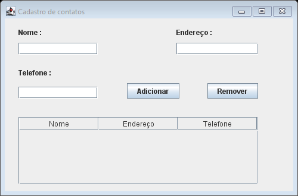
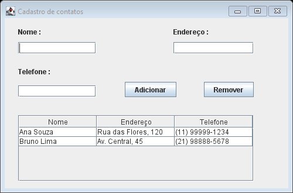

# Cadastro de contatos

Aplicação desktop simples feita em Java Swing para praticar formulários, eventos, tabelas e separação entre interface e dados. É um projeto de estudo: os contatos ficam somente na memória e são apagados quando a aplicação é fechada.

## Capturas de tela





## Funcionalidades

- Cadastrar contato com nome, endereço e telefone.
- Avisar quando algum campo obrigatório estiver vazio.
- Exibir os contatos em uma tabela que permite ordenar pelas colunas.
- Remover o contato selecionado.
- Limpar os campos após um cadastro bem-sucedido.

## Organização do código

```text
src/inserir/excluir/linhas/
├── InserirExcluirLinhas.java       # ponto de entrada da aplicação
├── model/
│   ├── Contato.java                # dados de um contato
│   └── ContatoTableModel.java      # dados e operações da tabela Swing
└── ui/
    ├── JCadastro.java             # janela e eventos da interface
    └── JCadastro.form              # formulário editável pelo NetBeans
```

O modelo concentra a lista de contatos e notifica a `JTable` quando uma linha é incluída ou removida. A janela cuida da validação simples dos campos e encaminha as ações ao modelo. A classe `InserirExcluirLinhas` inicia a interface na fila de eventos do Swing.

## Requisitos

- JDK 8 ou superior.
- Apache NetBeans com suporte a projetos Java Ant, ou Apache Ant instalado.

## Como executar

### NetBeans

Abra a pasta do projeto no NetBeans e use **Executar projeto**. O projeto mantém os arquivos Ant do NetBeans e usa `InserirExcluirLinhas` como classe principal.

### Terminal com Ant

Na pasta do projeto, compile e execute com:

```bash
ant clean jar
java -jar dist/CadastroDeContatos.jar
```

Também é possível compilar diretamente com `javac` (JDK 8+):

```bash
javac -encoding UTF-8 -d build/classes $(find src -name '*.java')
java -cp build/classes inserir.excluir.linhas.InserirExcluirLinhas
```

No PowerShell, o comando equivalente para compilar os arquivos é:

```powershell
$sources = Get-ChildItem src -Recurse -Filter *.java | ForEach-Object { $_.FullName }
javac -encoding UTF-8 -d build/classes $sources
java -cp build/classes inserir.excluir.linhas.InserirExcluirLinhas
```


